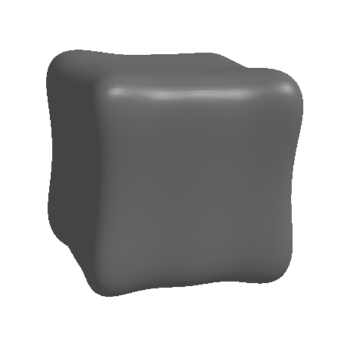
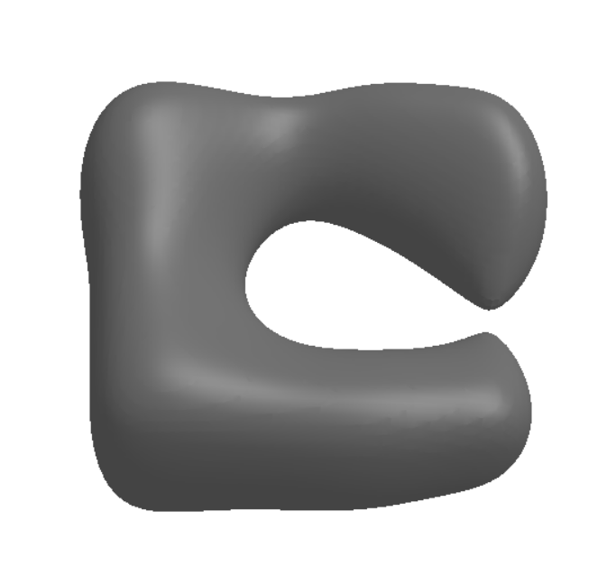
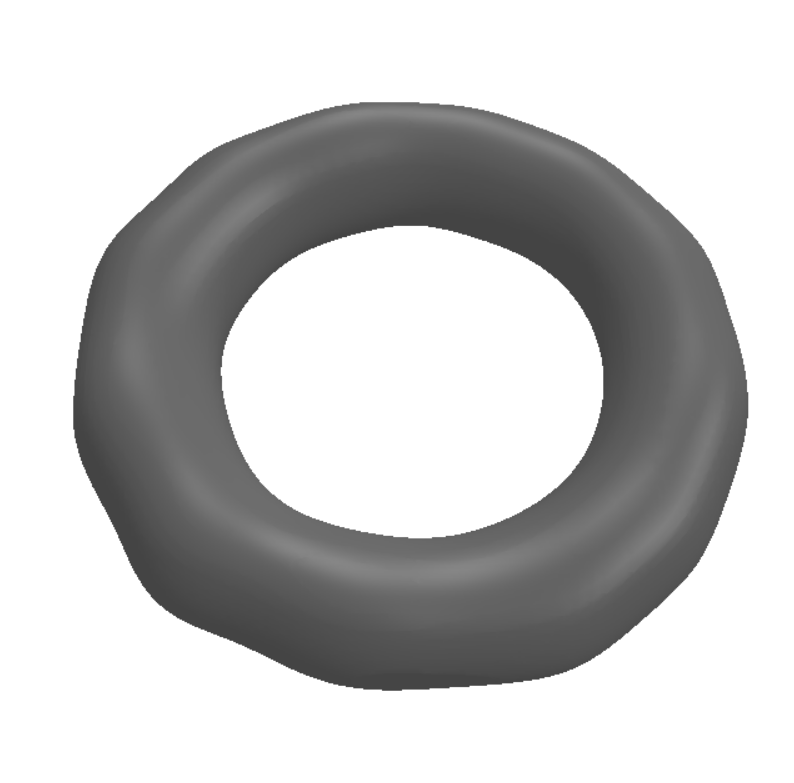
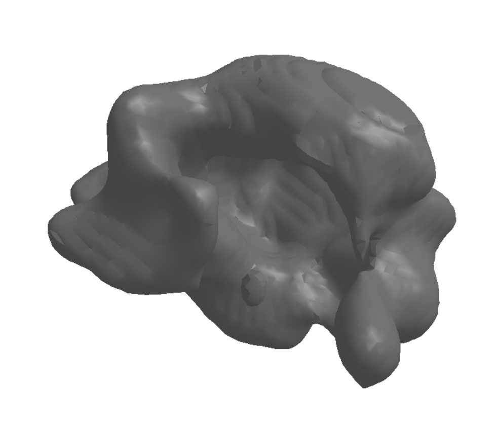

# Learning Smooth Neural Functions via Lipschitz Regularization
## Implementation by Rafael Dubeau
## Final project submission for CSC419

This is an implementation of the paper: https://www.dgp.toronto.edu/~hsuehtil/pdf/lipmlp.pdf

## Program Structure:
- `datasets.py`: Contains code to generate and store SDF data for given .obj files
- `networks.py`: Contains the neural network code
- `train.py`: Contains code to train a model to fit sampled SDF data
- `render.py`: Contains code to display learned SDF functions
- `test_mesh.py`: Contains code to test whether or not a mesh is compatible with the SDF sampling code used in this project
- `data/objects`: Folder containing the .obj files
- `data/datasets`: Folder containing the stored SDF data
- `data/models`: Folder containing trained model parameters

I have included the following pretrained models:
- `cube_15.pth`: A non-Lipschitz regularized model trained on a cube for 15 epochs.
- `cube_torus_30.pth`: A non-Lipschitz regularized model trained on a cube and torus for 30 epochs.
- `cube_torus_lipschitz_60.pth`: A Lipschitz regularized model trained on a cube and torus for 60 epochs.
- `cube_max_torus_lipschitz_20.pth`: A Lipschitz regularized model trained on a cube, torus and max for 20 epochs.

## Setup
- Create a new conda environment using python version 3.9
- Use `environment.yaml` to install all the necessary packages

## Usage
1. To train a model for some given meshes, the .obj files must first be placed into the `data/objects` folder.
2. Once the mesh is in the right folder, a dataset of (point, signed-distance) pairs can be generated by running the `datasets.py` script.\
For example, `python datasets.py cube` would generate a dataset of 500000 sampled points from the `cube.obj` mesh.
3. Once the dataset has been generated, a model can be trained to fit one or more of these meshes by running the `train.py` script.\
For example `python train.py cube torus -e 30 -s 0 -l` would train a model from scratch for 30 epochs to learn the SDFs of the cube and torus meshes using Lipschitz regularization.\
This script takes as arguments
    - The names of the objects you want to learn
    - The number of epochs to train for
    - The starting epoch (if continuing training from a previously saved model)
    - Whether or not to use Lipschitz regularization
4. Once a model has been trained, you can render the learned SDF by running the `render.py` script.\
For example, `python render.py cube torus -l -e 60 -t 0.3` would render an the SDF of the model with Lipschitz regularization that was trained for 60 epochs to fit the cube and torus meshes with the latent code t=0.3.\
If the model was trained on only object, then no latent code is needed. If the model was trained on 2 objects, the then latent code should be a number near the interval [0,1] with 0 encoding the first object and 1 encoding the second. If the model was trained on 3 or more objects, the the latent code is a list of numbers without spaces (e.g. [0.3,0.3,0.4]) where each object is encoded by a one-hot vector. So if a model was trained to fit 4 objects, the latent code would be a list of 4 numbers.

**A full breakdown of all the command line arguments is given in the `-h` command of each script.**

## Example Output
`python render.py cube torus -l -e 60 -t 0`

`python render.py cube torus -l -e 60 -t 0.5`

`python render.py cube torus -l -e 60 -t 1`

For comparison, here is the interpolated result without Lipshitz regularization:\
`python render.py cube torus -e 30 -t 0.5`

